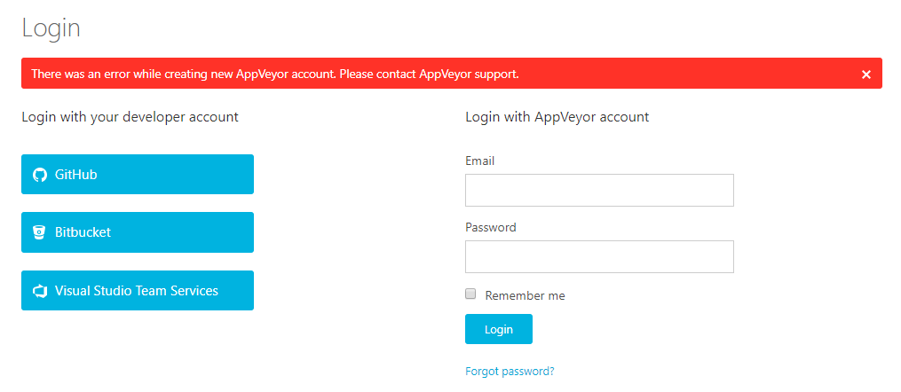
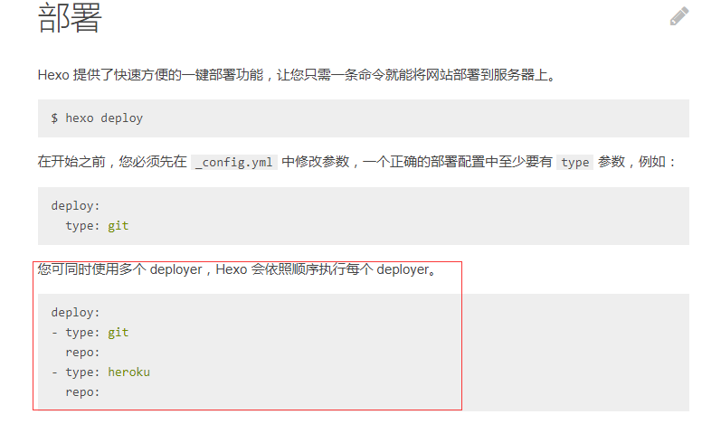

## 回顾

上一篇文章写了hexo+github+next的搭建，最后也总结了一些问题，其中最重要的就是如何同步。


**同步的场景有很多：**

​	更换电脑同步之前的文章。

​	家里和公司两台电脑同步文章。

 	或者外出使用其他电脑需要同步文章。


在上篇文章底部我也放入的他人写的解决同步的办法，我自己也进行的尝试。感觉还是有可以优化的地方，所以我还是单独写了这篇文章。


## 同步办法

解决同步的办法有很多，我也总结了一下：

1. 移动硬盘大法

   使用移动硬盘把源代码保存起来，在新电脑上重新安装[git](https://git-scm.com/download/)，[Nodejs](http://nodejs.cn/)，[hexo](https://hexo.io/)等环境即可！

2. 云盘大法

   这个和移动硬盘的存储方式一样，使用的云盘的同步功能，比硬盘好一点的地方是，只要有改动，文件随之同步到云盘了。但是现在的云盘大部分都是收费的，不划算啊！

3. github+AppVeyor方法

   就是使用github创建两个仓库，一个存储发布的博客html。（既上一篇文章说的 xxx.github.io仓库），再创建一个仓库存储源码，然后通过git命令上传源码内容。AppVeyor是一个持续集成工具，作用就是帮助你省去哪些命令行，AppVeyor能自动生成静态网站并push到仓库，这个方法有很多文章写怎么做了，我也想尝试,但是我在注册就成了这样的结果：

   

   也找不到解决办法，没办法了。。。

4. github存储

   这种方法实际是第三种方法的简易版，因为不能通过高新技术（AppVeyor），那就手动操作吧。

## 操作步骤

我才用github仓库分支的方式，省去重新创建一个仓库的烦恼（如果认为分支麻烦的话那就新建仓库吧）

### 直接上命令行吧：

```shell
$ cd blog
$ git init
$ git checkout -b source
$ git add .
$ git commit -m "first commit"
$ git remote add origin git@github.com:change2hao/change2hao.github.io.git
$ git push origin source
```

此处的具体步骤还有使用主题冲突问题都可以在上篇最后的参考文章[关于博客同步的解决办法](http://devtian.me/2015/03/17/blog-sync-solution/)找到答案。

### 精简操作

通过上面的步骤就把源码给上传到分支上，在另一台电脑clone下来，安装环境即可。上述命令行还可以使用git的图形界面工具进行处理（如：sourceTree），这里就不介绍，有兴趣的可以下载使用。


总结一下发布文章及同步源码的步骤：

1. 创建新文章
2. 生成静态文件及部署到站点
3. 回到根目录提交source分支源码

能不能把2和3一步搞定呢，上边说的方法3可以实现，但是我没法尝试。那就继续寻找，看[hexo的官方文档](https://hexo.io/zh-cn/docs/deployment.html)发现



hexo支持多分支部署，那么第二步生成静态文件部署到站点的同时能提交源码分支代码吗，答案是肯定的。


直接开始精简，打开上篇文章说的配置部署仓库的配置文件**_config.yml**，找到最下边deploy:

```shell
 deploy:
   # 使用 Git 提交
 - type: git
   # 就是存放博客的仓库地址
   repo: https://github.com/xxx/xxx.github.io.git
   # 主分支
   branch: master
 - type: git
   repo: https://github.com/xxx/xxx.github.io.git
   # 源码分支
   branch: source
   extend_dirs: /
   ignore_hidden: false
   ignore_pattern:
       public: .
```

配置完成后，在发布一下试试，看看是不是有惊喜发现。


## 总结

仅仅通过简单的添加一个新的分支，配置一个忽略目录，直接就在部署站点的时间同时把源码也已经提交了，更换电脑的时间，只需要克隆source分支的代码，安装一下环境即可！！！


写完了，让我再试一下部署这个新文章啊！！


[参考]:http://devtian.me/2015/03/17/blog-sync-solution/

